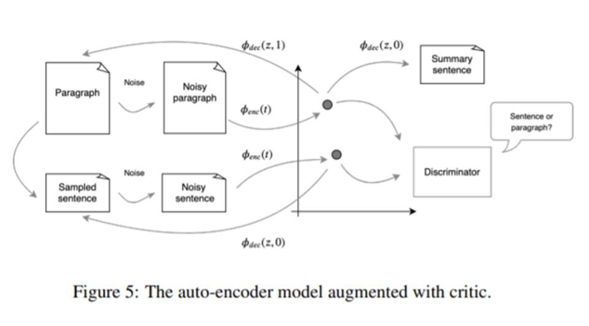
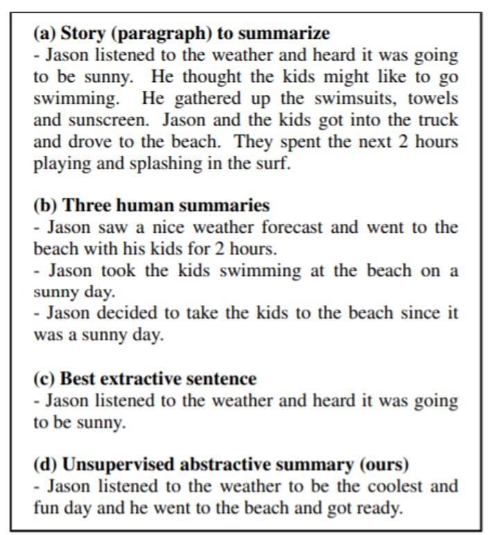
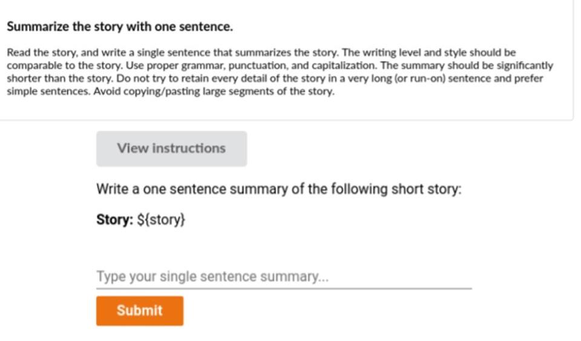

# SummAE-from-Google-Brain-and-MIT-CSAIL

Let Artificial Intelligence do effective summary for you with #SummAE from Google Brain and MIT CSAIL – largely unsupervised method that generalizes from a small amount of training data to unseen text. It is based on a denoising auto-encoder with several self-supervised pre-training techniques for model enhancement

Read https://arxiv.org/pdf/1910.00998.pdf
